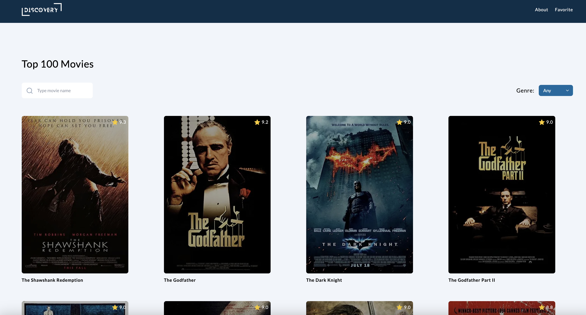

## Top Movies App

Top Movies App includes a list of top 100 movies, where you can search and save movies as favorite.



## Table of contents

- [Top Movies App](#top-movies-app)
- [Table of contents](#table-of-contents)
- [Demo](#demo)
- [Set Up API Key](#set-up-api-key)
- [Getting Started](#getting-started)
- [Tech I used](#tech-i-used)
- [API](#api)
- [Design](#design)
- [Future plan](#future-plan)
- [Learn More](#learn-more)

## Demo

You can see my project on Vercel [Demo Link](https://top-movies-nine.vercel.app)

## Set Up API Key

First of all, set up API Key

``
1. Create `.env.local` file on the root path
2. Inside the file, declare a variable with API Key, like this: `NEXT_PUBLIC_MOVIE_API_KEY=<your-api-key>`
   or use `top_100_movies.json file` as default
``

## Getting Started

Firstly, install node_modules dependencies`npm install or yarn install`

Secondly, run the development server:

```bash
npm run dev
# or
yarn dev
```

## Tech I used

- React
- Next.js 13
- TailwindCSS
- React Icon
- React Context API
- Test Library(Jest and Cypress)

## API

Movie RESTful API

- [API Documentation](https://rapidapi.com/rapihub-rapihub-default/api/imdb-top-100-movies)

## Design

Font

- [Lato](https://fonts.google.com/specimen/Lato)

Color

- [Sky & Slate](https://tailwindcss.com/docs/customizing-colors)

## Future plan

- Pagination in order to improve UX
- Responsive Design 

## Learn More

To learn more about the project, take a look at the following resources:

- [HTML Inputs and Labels: A Love Story](https://css-tricks.com/html-inputs-and-labels-a-love-story/)

- [Next13 Dynamic Routing](https://stackoverflow.com/questions/75783445/dynamic-routing-in-next-js-13-app-directory-throwing-404-not-found-error)

- [Merge/Flatten Array](https://stackoverflow.com/questions/10865025/merge-flatten-an-array-of-arrays)

- [Remove duplicate values from JS Array](https://stackoverflow.com/questions/9229645/remove-duplicate-values-from-js-array)

- [Array.from method creates a new, shallow-copied](https://developer.mozilla.org/en-US/docs/Web/JavaScript/Reference/Global_Objects/Array/from)

- [Responsive TailwildCSS Embed Video](https://www.themes.dev/blog/easily-embed-responsive-youtube-video-with-tailwind-css/)
